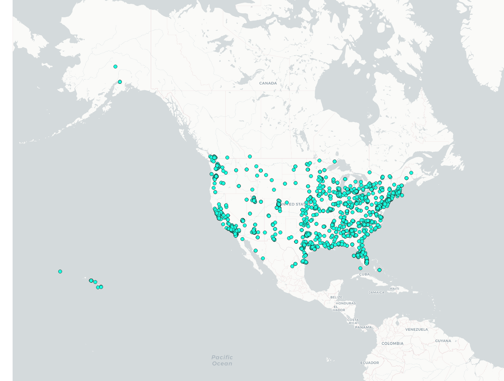
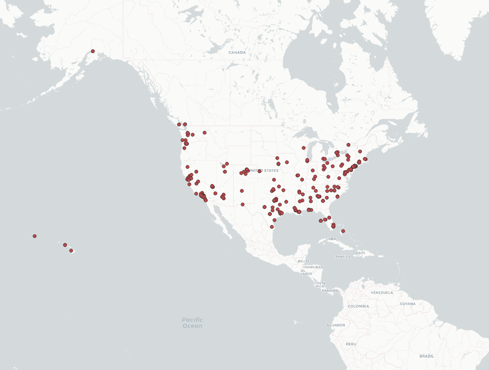
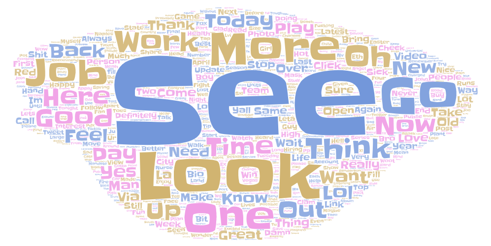
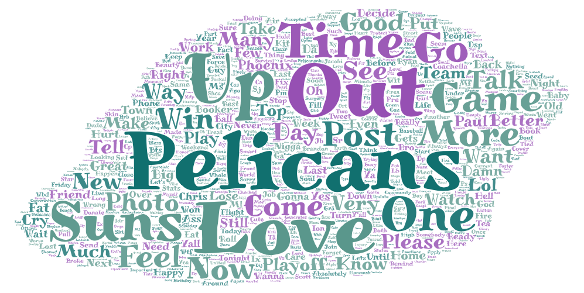

# Lab2
## Geo-Tagged Tweet Collection And Visualization

1) The two comparison that I did was the time period. For the first time I ran the ipynb around 2 pm and the second time i ran the ipynb is around 9 pm. They were both on the same day but the results were completely different.

2) Even though the two maps share the same location and key words in the tweet they are both different because of the time. For the first one, the time is in the day when every body is awake and going on about their daily lives while in the second one, the time is at about 10 pm my time which can be 1 am EDT when most people are asleep.

3) The two context are totally different because when you run the ipynb they print out the tweets that was recent. The tweets that was printed at 3 in the afternoon are not going to be the same as the tweets that was printed at 10. The topics are not going to be the samw.
